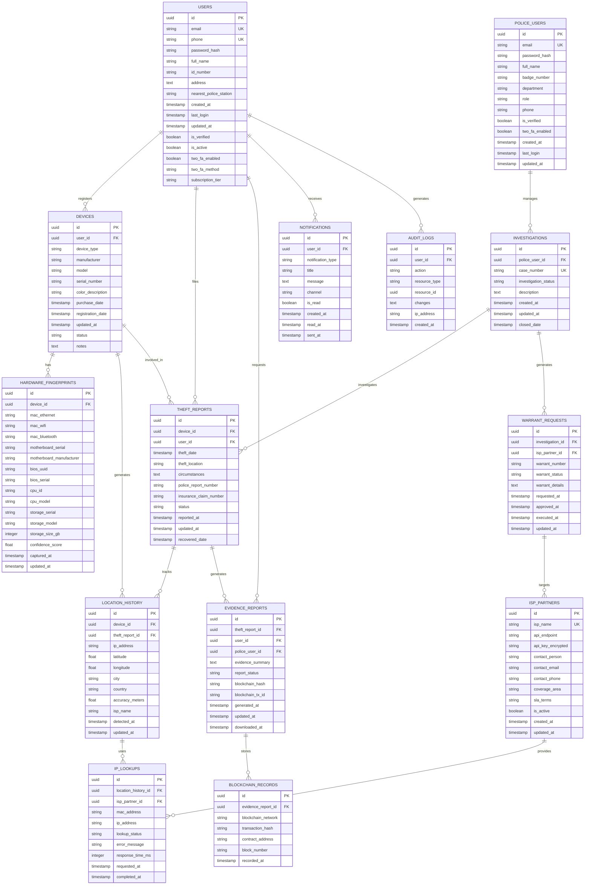

# Database Design Document
## Hardware-Based Persistent Tracking System

**Document Version:** 1.0  
**Date:** March 2026  
**Status:** Final

---

## 1. Introduction

### 1.1 Purpose
This document specifies the database design for the Hardware-Based Persistent Tracking System, including schema design, entity relationships, and data management strategies.

### 1.2 Technology Stack
- **Database:** PostgreSQL 15+
- **ORM:** SQLAlchemy (Python) or Sequelize (Node.js)
- **Backup:** AWS S3 / Azure Blob Storage
- **Replication:** PostgreSQL Streaming Replication
- **Caching:** Redis 7+

---

## 2. Entity-Relationship Diagram

---

## 3. Table Definitions

### 3.1 USERS Table

**Purpose:** Store user account information

**Table Name:** `users`

| Column | Type | Constraints | Description |
|--------|------|-----------|-------------|
| id | UUID | PRIMARY KEY | Unique user identifier |
| email | VARCHAR(255) | UNIQUE, NOT NULL | User email address |
| phone | VARCHAR(20) | UNIQUE | User phone number |
| password_hash | VARCHAR(255) | NOT NULL | Hashed password (bcrypt) |
| full_name | VARCHAR(255) | NOT NULL | User's full name |
| id_number | VARCHAR(50) | | Government ID number |
| address | TEXT | | User's address |
| nearest_police_station | VARCHAR(255) | | Nearest police station |
| created_at | TIMESTAMP | NOT NULL, DEFAULT NOW() | Account creation timestamp |
| last_login | TIMESTAMP | | Last login timestamp |
| updated_at | TIMESTAMP | NOT NULL, DEFAULT NOW() | Last update timestamp |
| is_verified | BOOLEAN | NOT NULL, DEFAULT FALSE | Email verification status |
| is_active | BOOLEAN | NOT NULL, DEFAULT TRUE | Account active status |
| two_fa_enabled | BOOLEAN | NOT NULL, DEFAULT FALSE | 2FA enabled status |
| two_fa_method | VARCHAR(50) | | 2FA method (sms, totp) |
| subscription_tier | VARCHAR(50) | NOT NULL, DEFAULT 'free' | Subscription level |

**Indexes:**
- PRIMARY KEY: id
- UNIQUE: email, phone
- INDEX: created_at, subscription_tier, is_active

---

### 3.2 DEVICES Table

**Purpose:** Store registered device information

**Table Name:** `devices`

| Column | Type | Constraints | Description |
|--------|------|-----------|-------------|
| id | UUID | PRIMARY KEY | Unique device identifier |
| user_id | UUID | FOREIGN KEY, NOT NULL | Reference to user |
| device_type | VARCHAR(50) | NOT NULL | Device type (laptop, phone, tablet) |
| manufacturer | VARCHAR(255) | NOT NULL | Device manufacturer |
| model | VARCHAR(255) | NOT NULL | Device model |
| serial_number | VARCHAR(255) | NOT NULL | Device serial number |
| color_description | VARCHAR(255) | | Device color/description |
| purchase_date | DATE | | Device purchase date |
| registration_date | TIMESTAMP | NOT NULL, DEFAULT NOW() | Registration timestamp |
| updated_at | TIMESTAMP | NOT NULL, DEFAULT NOW() | Last update timestamp |
| status | VARCHAR(50) | NOT NULL, DEFAULT 'active' | Device status |
| notes | TEXT | | Additional notes |

**Indexes:**
- PRIMARY KEY: id
- FOREIGN KEY: user_id
- INDEX: user_id, status, registration_date
- INDEX: serial_number

---

### 3.3 HARDWARE_FINGERPRINTS Table

**Purpose:** Store hardware fingerprint data for devices

**Table Name:** `hardware_fingerprints`

| Column | Type | Constraints | Description |
|--------|------|-----------|-------------|
| id | UUID | PRIMARY KEY | Unique fingerprint identifier |
| device_id | UUID | FOREIGN KEY, NOT NULL | Reference to device |
| mac_ethernet | VARCHAR(17) | | Ethernet MAC address |
| mac_wifi | VARCHAR(17) | | WiFi MAC address |
| mac_bluetooth | VARCHAR(17) | | Bluetooth MAC address |
| motherboard_serial | VARCHAR(255) | | Motherboard serial number |
| motherboard_manufacturer | VARCHAR(255) | | Motherboard manufacturer |
| bios_uuid | VARCHAR(255) | | BIOS UUID |
| bios_serial | VARCHAR(255) | | BIOS serial number |
| cpu_id | VARCHAR(255) | | CPU ID |
| cpu_model | VARCHAR(255) | | CPU model |
| storage_serial | VARCHAR(255) | | Storage drive serial |
| storage_model | VARCHAR(255) | | Storage drive model |
| storage_size_gb | INTEGER | | Storage size in GB |
| confidence_score | FLOAT | NOT NULL | Fingerprint confidence (0-1) |
| captured_at | TIMESTAMP | NOT NULL | Capture timestamp |
| updated_at | TIMESTAMP | NOT NULL, DEFAULT NOW() | Last update timestamp |

**Indexes:**
- PRIMARY KEY: id
- FOREIGN KEY: device_id
- INDEX: device_id, captured_at
- INDEX: mac_wifi, mac_ethernet

---

### 3.4 THEFT_REPORTS Table

**Purpose:** Store device theft reports

**Table Name:** `theft_reports`

| Column | Type | Constraints | Description |
|--------|------|-----------|-------------|
| id | UUID | PRIMARY KEY | Unique report identifier |
| device_id | UUID | FOREIGN KEY, NOT NULL | Reference to device |
| user_id | UUID | FOREIGN KEY, NOT NULL | Reference to user |
| theft_date | TIMESTAMP | NOT NULL | Date/time of theft |
| theft_location | VARCHAR(255) | | Location of theft |
| circumstances | TEXT | | Circumstances of theft |
| police_report_number | VARCHAR(100) | | Police report number |
| insurance_claim_number | VARCHAR(100) | | Insurance claim number |
| status | VARCHAR(50) | NOT NULL, DEFAULT 'active' | Report status |
| reported_at | TIMESTAMP | NOT NULL, DEFAULT NOW() | Report timestamp |
| updated_at | TIMESTAMP | NOT NULL, DEFAULT NOW() | Last update timestamp |
| recovered_date | TIMESTAMP | | Recovery date (if recovered) |

**Indexes:**
- PRIMARY KEY: id
- FOREIGN KEY: device_id, user_id
- INDEX: device_id, status, reported_at
- INDEX: police_report_number

---

### 3.5 LOCATION_HISTORY Table

**Purpose:** Store device location history based on IP tracking

**Table Name:** `location_history`

| Column | Type | Constraints | Description |
|--------|------|-----------|-------------|
| id | UUID | PRIMARY KEY | Unique location record identifier |
| device_id | UUID | FOREIGN KEY, NOT NULL | Reference to device |
| theft_report_id | UUID | FOREIGN KEY | Reference to theft report |
| ip_address | VARCHAR(45) | NOT NULL | IP address (IPv4/IPv6) |
| latitude | FLOAT | | Geographic latitude |
| longitude | FLOAT | | Geographic longitude |
| city | VARCHAR(255) | | City name |
| country | VARCHAR(255) | | Country name |
| accuracy_meters | FLOAT | | Location accuracy in meters |
| isp_name | VARCHAR(255) | | ISP name |
| detected_at | TIMESTAMP | NOT NULL | Detection timestamp |
| updated_at | TIMESTAMP | NOT NULL, DEFAULT NOW() | Last update timestamp |

**Indexes:**
- PRIMARY KEY: id
- FOREIGN KEY: device_id, theft_report_id
- INDEX: device_id, detected_at
- INDEX: ip_address, detected_at
- SPATIAL INDEX: (latitude, longitude)

---

### 3.6 IP_LOOKUPS Table

**Purpose:** Store MAC-to-IP lookup records from ISPs

**Table Name:** `ip_lookups`

| Column | Type | Constraints | Description |
|--------|------|-----------|-------------|
| id | UUID | PRIMARY KEY | Unique lookup identifier |
| location_history_id | UUID | FOREIGN KEY | Reference to location history |
| isp_partner_id | UUID | FOREIGN KEY, NOT NULL | Reference to ISP partner |
| mac_address | VARCHAR(17) | NOT NULL | MAC address queried |
| ip_address | VARCHAR(45) | NOT NULL | IP address returned |
| lookup_status | VARCHAR(50) | NOT NULL | Status (success, failed, timeout) |
| error_message | TEXT | | Error message if failed |
| response_time_ms | INTEGER | | API response time in ms |
| requested_at | TIMESTAMP | NOT NULL, DEFAULT NOW() | Request timestamp |
| completed_at | TIMESTAMP | | Completion timestamp |

**Indexes:**
- PRIMARY KEY: id
- FOREIGN KEY: location_history_id, isp_partner_id
- INDEX: mac_address, requested_at
- INDEX: isp_partner_id, requested_at

---

### 3.7 ISP_PARTNERS Table

**Purpose:** Store ISP partner information

**Table Name:** `isp_partners`

| Column | Type | Constraints | Description |
|--------|------|-----------|-------------|
| id | UUID | PRIMARY KEY | Unique ISP identifier |
| isp_name | VARCHAR(255) | UNIQUE, NOT NULL | ISP name |
| api_endpoint | VARCHAR(500) | NOT NULL | API endpoint URL |
| api_key_encrypted | TEXT | NOT NULL | Encrypted API key |
| contact_person | VARCHAR(255) | | Contact person name |
| contact_email | VARCHAR(255) | | Contact email |
| contact_phone | VARCHAR(20) | | Contact phone |
| coverage_area | VARCHAR(255) | | Geographic coverage area |
| sla_terms | TEXT | | SLA terms |
| is_active | BOOLEAN | NOT NULL, DEFAULT TRUE | Active status |
| created_at | TIMESTAMP | NOT NULL, DEFAULT NOW() | Creation timestamp |
| updated_at | TIMESTAMP | NOT NULL, DEFAULT NOW() | Last update timestamp |

**Indexes:**
- PRIMARY KEY: id
- UNIQUE: isp_name
- INDEX: is_active

---

### 3.8 EVIDENCE_REPORTS Table

**Purpose:** Store generated evidence reports

**Table Name:** `evidence_reports`

| Column | Type | Constraints | Description |
|--------|------|-----------|-------------|
| id | UUID | PRIMARY KEY | Unique report identifier |
| theft_report_id | UUID | FOREIGN KEY, NOT NULL | Reference to theft report |
| user_id | UUID | FOREIGN KEY, NOT NULL | Reference to user |
| police_user_id | UUID | FOREIGN KEY | Reference to police user |
| evidence_summary | TEXT | NOT NULL | Evidence summary |
| report_status | VARCHAR(50) | NOT NULL, DEFAULT 'draft' | Report status |
| blockchain_hash | VARCHAR(255) | | Blockchain hash |
| blockchain_tx_id | VARCHAR(255) | | Blockchain transaction ID |
| generated_at | TIMESTAMP | NOT NULL, DEFAULT NOW() | Generation timestamp |
| updated_at | TIMESTAMP | NOT NULL, DEFAULT NOW() | Last update timestamp |
| downloaded_at | TIMESTAMP | | Download timestamp |

**Indexes:**
- PRIMARY KEY: id
- FOREIGN KEY: theft_report_id, user_id, police_user_id
- INDEX: theft_report_id, generated_at
- INDEX: blockchain_hash

---

### 3.9 POLICE_USERS Table

**Purpose:** Store police user accounts

**Table Name:** `police_users`

| Column | Type | Constraints | Description |
|--------|------|-----------|-------------|
| id | UUID | PRIMARY KEY | Unique police user identifier |
| email | VARCHAR(255) | UNIQUE, NOT NULL | Email address |
| password_hash | VARCHAR(255) | NOT NULL | Hashed password |
| full_name | VARCHAR(255) | NOT NULL | Full name |
| badge_number | VARCHAR(50) | UNIQUE, NOT NULL | Police badge number |
| department | VARCHAR(255) | NOT NULL | Police department |
| role | VARCHAR(50) | NOT NULL | Role (officer, detective, admin) |
| phone | VARCHAR(20) | | Contact phone |
| is_verified | BOOLEAN | NOT NULL, DEFAULT FALSE | Verification status |
| two_fa_enabled | BOOLEAN | NOT NULL, DEFAULT TRUE | 2FA enabled |
| created_at | TIMESTAMP | NOT NULL, DEFAULT NOW() | Creation timestamp |
| last_login | TIMESTAMP | | Last login timestamp |
| updated_at | TIMESTAMP | NOT NULL, DEFAULT NOW() | Last update timestamp |

**Indexes:**
- PRIMARY KEY: id
- UNIQUE: email, badge_number
- INDEX: department, role

---

### 3.10 INVESTIGATIONS Table

**Purpose:** Store police investigations

**Table Name:** `investigations`

| Column | Type | Constraints | Description |
|--------|------|-----------|-------------|
| id | UUID | PRIMARY KEY | Unique investigation identifier |
| police_user_id | UUID | FOREIGN KEY, NOT NULL | Reference to police user |
| case_number | VARCHAR(100) | UNIQUE, NOT NULL | Case number |
| investigation_status | VARCHAR(50) | NOT NULL, DEFAULT 'open' | Status |
| description | TEXT | | Investigation description |
| created_at | TIMESTAMP | NOT NULL, DEFAULT NOW() | Creation timestamp |
| updated_at | TIMESTAMP | NOT NULL, DEFAULT NOW() | Last update timestamp |
| closed_date | TIMESTAMP | | Closure date |

**Indexes:**
- PRIMARY KEY: id
- FOREIGN KEY: police_user_id
- UNIQUE: case_number
- INDEX: investigation_status, created_at

---

### 3.11 WARRANT_REQUESTS Table

**Purpose:** Store warrant requests to ISPs

**Table Name:** `warrant_requests`

| Column | Type | Constraints | Description |
|--------|------|-----------|-------------|
| id | UUID | PRIMARY KEY | Unique warrant identifier |
| investigation_id | UUID | FOREIGN KEY, NOT NULL | Reference to investigation |
| isp_partner_id | UUID | FOREIGN KEY, NOT NULL | Reference to ISP partner |
| warrant_number | VARCHAR(100) | UNIQUE | Warrant number |
| warrant_status | VARCHAR(50) | NOT NULL, DEFAULT 'pending' | Status |
| warrant_details | TEXT | NOT NULL | Warrant details |
| requested_at | TIMESTAMP | NOT NULL, DEFAULT NOW() | Request timestamp |
| approved_at | TIMESTAMP | | Approval timestamp |
| executed_at | TIMESTAMP | | Execution timestamp |
| updated_at | TIMESTAMP | NOT NULL, DEFAULT NOW() | Last update timestamp |

**Indexes:**
- PRIMARY KEY: id
- FOREIGN KEY: investigation_id, isp_partner_id
- INDEX: warrant_status, requested_at

---

### 3.12 NOTIFICATIONS Table

**Purpose:** Store user notifications

**Table Name:** `notifications`

| Column | Type | Constraints | Description |
|--------|------|-----------|-------------|
| id | UUID | PRIMARY KEY | Unique notification identifier |
| user_id | UUID | FOREIGN KEY, NOT NULL | Reference to user |
| notification_type | VARCHAR(50) | NOT NULL | Notification type |
| title | VARCHAR(255) | NOT NULL | Notification title |
| message | TEXT | NOT NULL | Notification message |
| channel | VARCHAR(50) | NOT NULL | Channel (email, sms, push) |
| is_read | BOOLEAN | NOT NULL, DEFAULT FALSE | Read status |
| created_at | TIMESTAMP | NOT NULL, DEFAULT NOW() | Creation timestamp |
| read_at | TIMESTAMP | | Read timestamp |
| sent_at | TIMESTAMP | | Send timestamp |

**Indexes:**
- PRIMARY KEY: id
- FOREIGN KEY: user_id
- INDEX: user_id, is_read, created_at

---

### 3.13 AUDIT_LOGS Table

**Purpose:** Store audit logs for compliance

**Table Name:** `audit_logs`

| Column | Type | Constraints | Description |
|--------|------|-----------|-------------|
| id | UUID | PRIMARY KEY | Unique log identifier |
| user_id | UUID | FOREIGN KEY | Reference to user |
| action | VARCHAR(255) | NOT NULL | Action performed |
| resource_type | VARCHAR(50) | NOT NULL | Resource type |
| resource_id | UUID | | Resource identifier |
| changes | JSONB | | Changes made (JSON) |
| ip_address | VARCHAR(45) | | User IP address |
| created_at | TIMESTAMP | NOT NULL, DEFAULT NOW() | Timestamp |

**Indexes:**
- PRIMARY KEY: id
- FOREIGN KEY: user_id
- INDEX: created_at, action
- INDEX: resource_type, resource_id

---

### 3.14 BLOCKCHAIN_RECORDS Table

**Purpose:** Store blockchain evidence records

**Table Name:** `blockchain_records`

| Column | Type | Constraints | Description |
|--------|------|-----------|-------------|
| id | UUID | PRIMARY KEY | Unique record identifier |
| evidence_report_id | UUID | FOREIGN KEY, NOT NULL | Reference to evidence report |
| blockchain_network | VARCHAR(50) | NOT NULL | Blockchain network |
| transaction_hash | VARCHAR(255) | NOT NULL | Transaction hash |
| contract_address | VARCHAR(255) | | Smart contract address |
| block_number | BIGINT | | Block number |
| recorded_at | TIMESTAMP | NOT NULL, DEFAULT NOW() | Recording timestamp |

**Indexes:**
- PRIMARY KEY: id
- FOREIGN KEY: evidence_report_id
- INDEX: transaction_hash
- INDEX: recorded_at

---

## 4. Data Types & Constraints

### 4.1 Data Type Mapping

| Logical Type | PostgreSQL Type | Description |
|--------------|-----------------|-------------|
| Identifier | UUID | Universally unique identifier |
| Text (Short) | VARCHAR(n) | Variable-length string |
| Text (Long) | TEXT | Unlimited-length string |
| Number (Integer) | INTEGER | 32-bit integer |
| Number (Large) | BIGINT | 64-bit integer |
| Number (Decimal) | FLOAT | Floating-point number |
| Boolean | BOOLEAN | True/False value |
| Date/Time | TIMESTAMP | Date and time with timezone |
| Date | DATE | Date only |
| JSON | JSONB | JSON binary format |

### 4.2 Constraints

- **PRIMARY KEY:** Uniquely identifies each row
- **FOREIGN KEY:** Maintains referential integrity
- **UNIQUE:** Ensures uniqueness of column values
- **NOT NULL:** Ensures column has a value
- **DEFAULT:** Provides default value if not specified
- **CHECK:** Validates column values against conditions

---

## 5. Indexing Strategy

### 5.1 Index Types

**Primary Key Indexes:**
- Automatically created on all primary key columns
- Used for fast row lookup

**Foreign Key Indexes:**
- Created on all foreign key columns
- Used for JOIN operations

**Search Indexes:**
- Created on frequently searched columns (email, phone, device_id)
- Improves query performance

**Range Indexes:**
- Created on timestamp columns for range queries
- Improves performance for date-based searches

**Spatial Indexes:**
- Created on latitude/longitude columns
- Enables geographic queries

### 5.2 Index Maintenance

- Indexes are automatically updated on INSERT/UPDATE/DELETE
- Index fragmentation should be monitored
- Indexes should be rebuilt monthly
- Unused indexes should be identified and removed

---

## 6. Partitioning Strategy

### 6.1 Location History Partitioning

**Partition by:** `detected_at` (monthly partitions)

**Rationale:** Location history grows rapidly; monthly partitions improve query performance and enable archival of old data.

### 6.2 Audit Logs Partitioning

**Partition by:** `created_at` (monthly partitions)

**Rationale:** Audit logs grow continuously; partitioning enables efficient archival and compliance with retention policies.

### 6.3 IP Lookups Partitioning

**Partition by:** `requested_at` (weekly partitions)

**Rationale:** High volume of lookups; weekly partitions improve query performance.

---

## 7. Backup & Recovery

### 7.1 Backup Strategy

- **Full Backup:** Daily at 2:00 AM UTC
- **Incremental Backup:** Every 6 hours
- **Backup Location:** AWS S3 with cross-region replication
- **Retention:** 30 days for daily backups, 1 year for monthly backups

### 7.2 Recovery Procedures

- Recovery Time Objective (RTO): 1 hour
- Recovery Point Objective (RPO): 15 minutes
- Backup restoration tested monthly

---

## 8. Performance Optimization

### 8.1 Query Optimization

- Use EXPLAIN ANALYZE to identify slow queries
- Create indexes on frequently used WHERE clauses
- Use LIMIT clause to reduce result sets
- Avoid SELECT * queries

### 8.2 Caching Strategy

- Cache frequently accessed data in Redis
- Cache TTL: 5 minutes for device data, 1 hour for user data
- Invalidate cache on data updates

### 8.3 Connection Pooling

- Use connection pooling to reduce connection overhead
- Maximum pool size: 100 connections
- Connection timeout: 30 seconds

---

## 9. Data Retention Policies

| Data Type | Retention Period | Rationale |
|-----------|-----------------|-----------|
| User Accounts | Until deletion request | User data |
| Device Registration | Until deregistration | Device tracking |
| Location History | 2 years | Legal evidence |
| Audit Logs | 2 years | Compliance |
| Notifications | 90 days | User convenience |
| IP Lookups | 1 year | Investigation history |
| Evidence Reports | Indefinite | Legal requirement |
| Blockchain Records | Indefinite | Immutable evidence |

---

## 10. Security Measures

### 10.1 Encryption

- All sensitive data encrypted at rest using AES-256
- All data in transit encrypted using TLS 1.3
- Encryption keys managed by HSM
- Key rotation annually

### 10.2 Access Control

- Role-based access control (RBAC)
- Row-level security (RLS) for sensitive data
- API key authentication for external access
- Audit logging of all data access

### 10.3 Data Masking

- PII masked in logs and reports
- Phone numbers masked except last 4 digits
- Email addresses partially masked
- Police access to full data logged

---

## End of Database Design Document
