# System Architecture & UML Diagrams
## Hardware-Based Persistent Tracking System

**Document Version:** 1.0  
**Date:** March 2026  
**Status:** Final

---

## 1. System Architecture Overview

### 1.1 High-Level Architecture

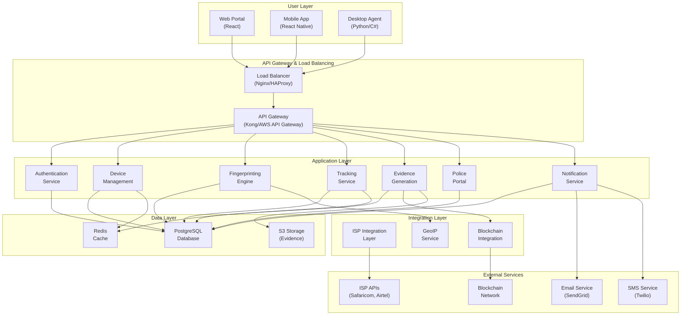

---

## 2. Component Diagram

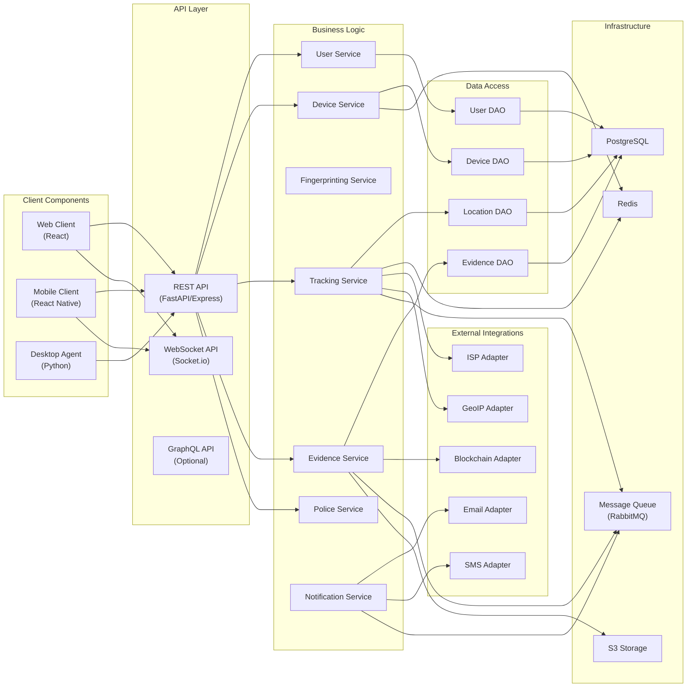

---

## 3. Use Case Diagram

```mermaid
graph TB
    subgraph "User Use Cases"
        UC1["Register Account"]
        UC2["Register Device"]
        UC3["View Dashboard"]
        UC4["Report Theft"]
        UC5["Download Evidence"]
        UC6["Manage Profile"]
    end
    
    subgraph "Police Use Cases"
        UC7["Search Stolen Device"]
        UC8["View Location History"]
        UC9["Generate Warrant"]
        UC10["Create Investigation"]
        UC11["View Evidence"]
    end
    
    subgraph "Admin Use Cases"
        UC12["Manage ISP Partners"]
        UC13["View System Metrics"]
        UC14["Manage Users"]
        UC15["Configure System"]
    end
    
    subgraph "System Use Cases"
        UC16["Detect Device Online"]
        UC17["Lookup IP Address"]
        UC18["Generate Evidence"]
        UC19["Send Notification"]
        UC20["Store Blockchain Record"]
    end
    
    USER["User"]
    POLICE["Police Officer"]
    ADMIN["System Admin"]
    SYSTEM["System"]
    
    USER --> UC1
    USER --> UC2
    USER --> UC3
    USER --> UC4
    USER --> UC5
    USER --> UC6
    
    POLICE --> UC7
    POLICE --> UC8
    POLICE --> UC9
    POLICE --> UC10
    POLICE --> UC11
    
    ADMIN --> UC12
    ADMIN --> UC13
    ADMIN --> UC14
    ADMIN --> UC15
    
    SYSTEM --> UC16
    SYSTEM --> UC17
    SYSTEM --> UC18
    SYSTEM --> UC19
    SYSTEM --> UC20
```

---

## 4. Activity Diagram - Device Registration Flow

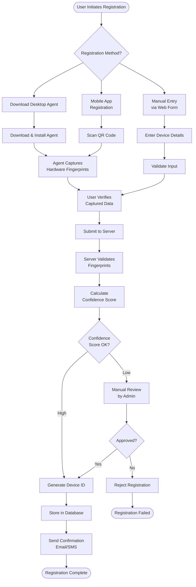

---

## 5. Activity Diagram - Theft Detection & Evidence Flow

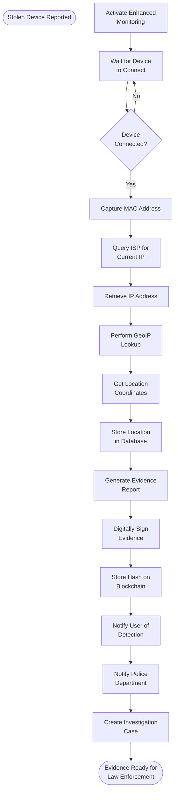

---

## 6. Activity Diagram - Police Investigation Workflow

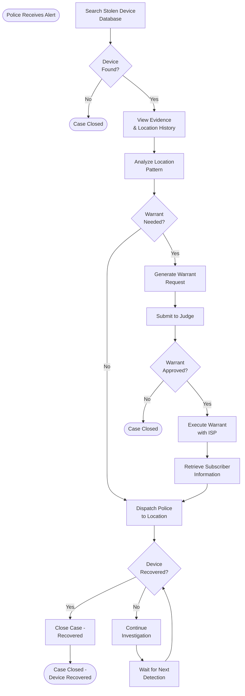

---

## 7. Sequence Diagram - Device Registration

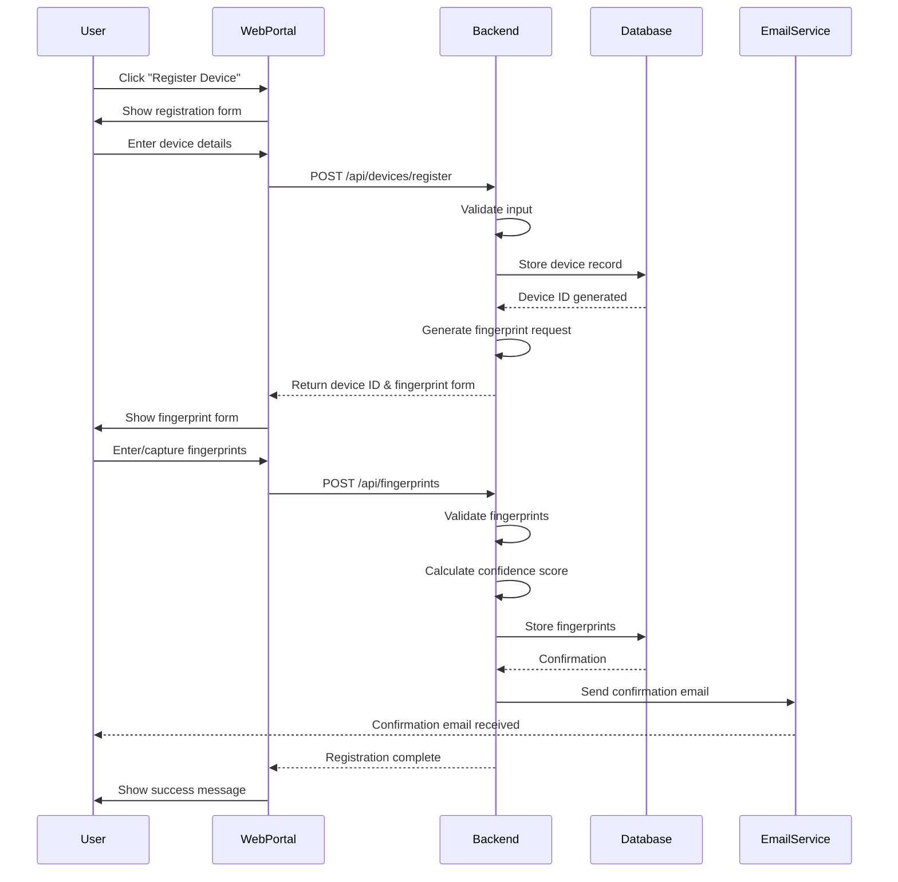

---

## 8. Sequence Diagram - Theft Detection & Tracking

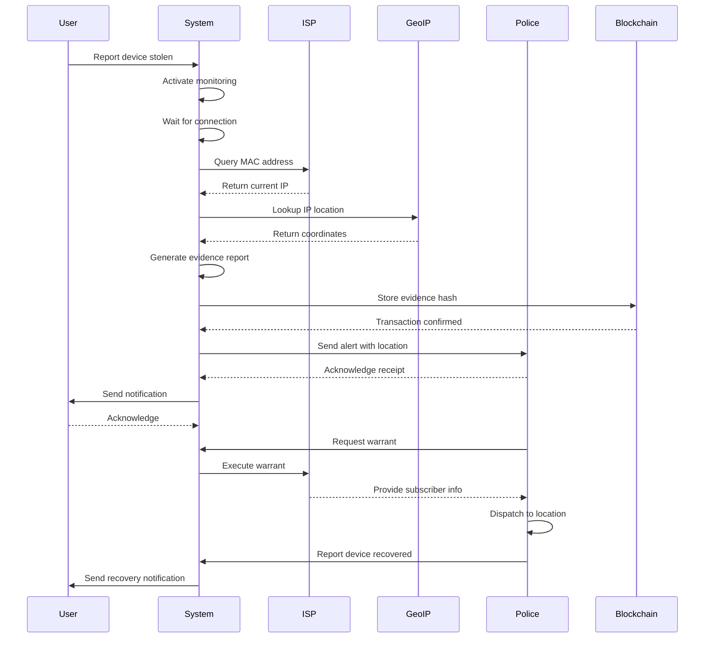

---

## 9. Sequence Diagram - Evidence Generation

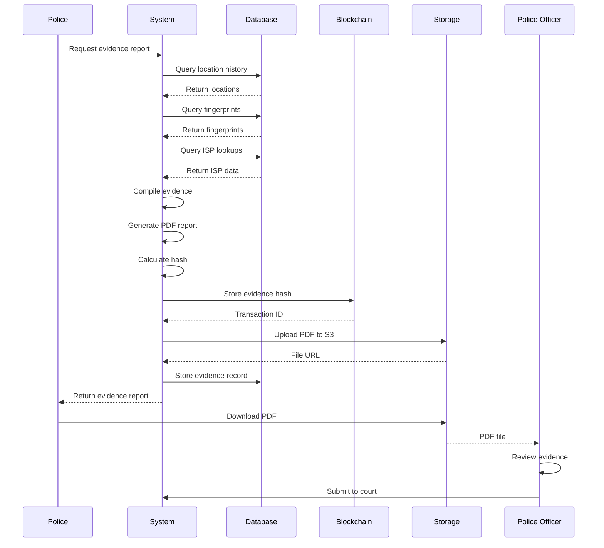

---

## 10. State Diagram - Device Status Lifecycle

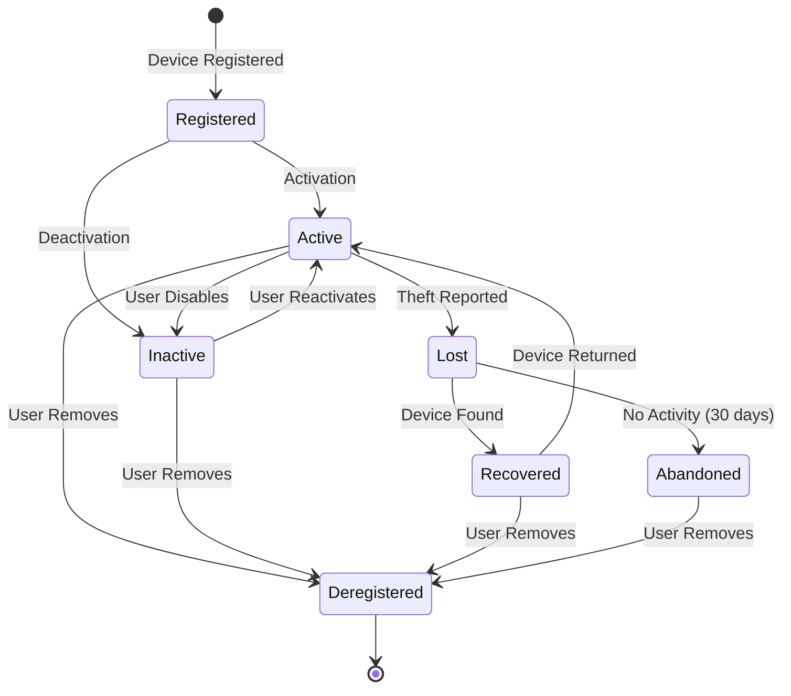

---

## 11. Deployment Architecture

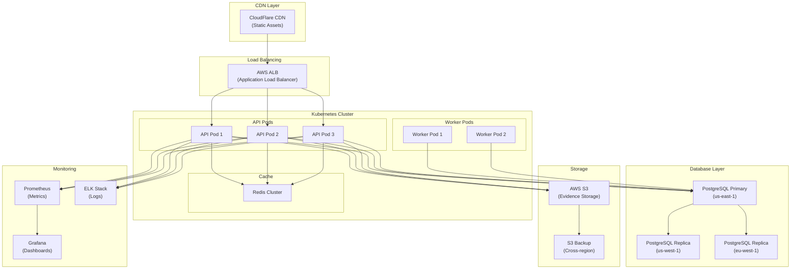

---

## 12. Data Flow Diagram - Level 0

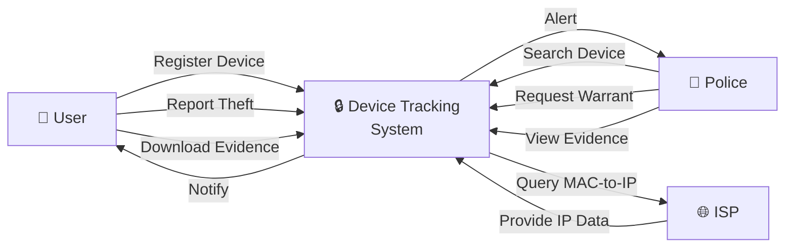

---

## 13. Data Flow Diagram - Level 1

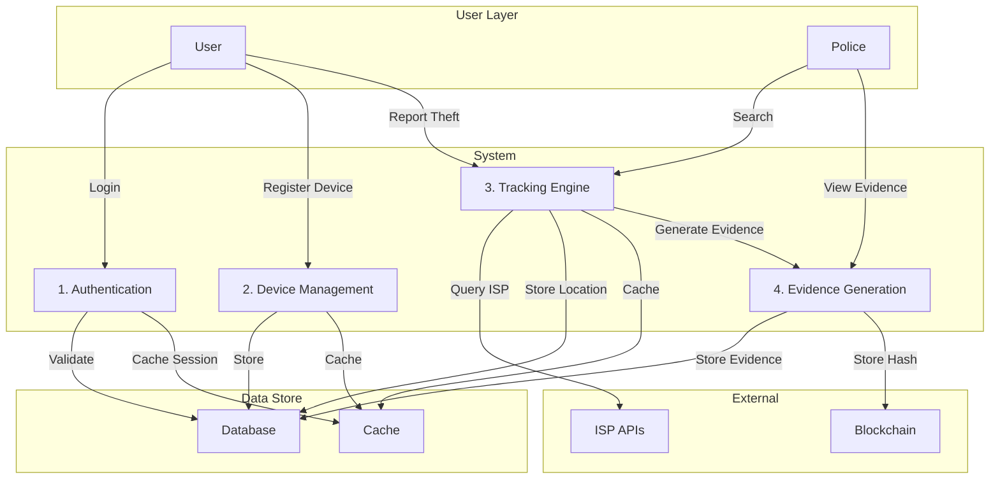

---

## 14. Network Diagram

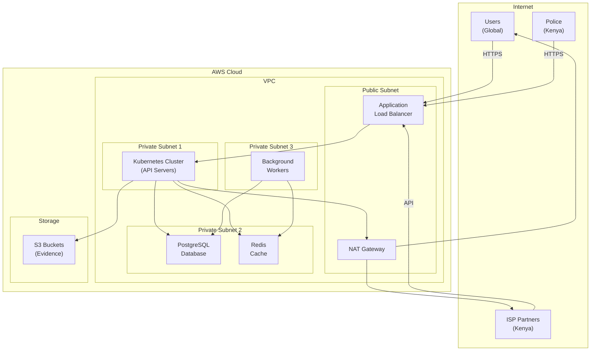

---

## End of System Architecture & UML Diagrams
